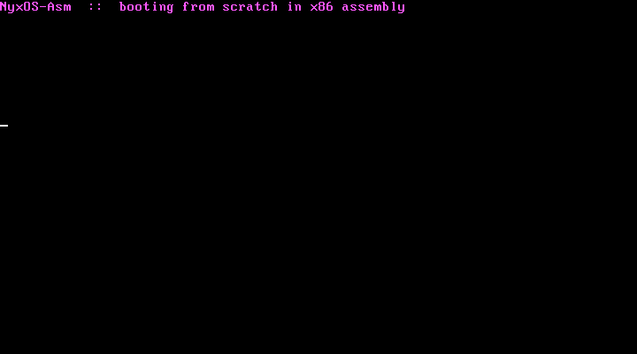

<div align="center">
  
</div>

<p align="center"><strong>NyxOS, rebuilt from scratch in x86 assembly — a freestanding Multiboot kernel that boots on bare metal</strong></p>

<p align="center">
  
  &nbsp;
  
  &nbsp;
  
  &nbsp;
  <a href="https://github.com/kazah-png/nyx-os"></a>
</p>

---

## About

Part of the **[NyxOS](https://github.com/kazah-png/nyx-os) family** — the same OS, rebuilt from zero in a different language each time. This is the **x86 assembly** cut: a Multiboot1 kernel written in pure NASM that GRUB (or `qemu -kernel`) loads in 32-bit protected mode. It sets up its own stack and paints a banner straight into VGA text memory at `0xB8000`. No C, no libc — nothing between the code and the CPU.

<div align="center">
  
  <p><em>NyxOS-Asm booting in QEMU — the banner is written directly to VGA text memory</em></p>
</div>

**Why assembly:** the ground floor — nothing sits between you and the machine. Proven in the wild by MikeOS and countless others.

## Build & run

Needs `nasm`, `ld`, and `qemu`.

```bash
make        # -> nyxos-asm.elf  (verified Multiboot with grub-file)
make run    # boot it in QEMU
```

## Layout

- `boot.asm` — the Multiboot header, entry point, and VGA banner
- `linker.ld` — links the kernel at 1 MiB, Multiboot header first
- `Makefile` — assemble, link, and boot

## Status

Early — it boots and paints the screen. Next up: a GDT, interrupt handling, and a proper text console.
